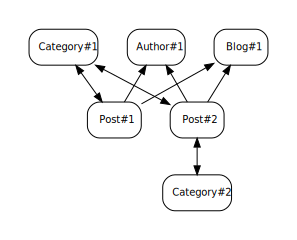
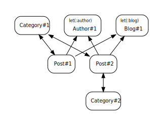

# Snapbot


Snapbot generates little diagrams via `save_and_open_diagram` for you to visualise the small constellations of 
ActiveRecord objects that you find in feature and integration tests. These are most often made by
 [FactoryBot](https://github.com/thoughtbot/factory_bot) or some other fixture-handling method, but this gem has no 
 opinions on those (beyond namechecking).
 


## Installation

Snapbot requires [Graphviz](https://graphviz.org/download/#executable-packages), and cannot function without it.
Install this first, then add the gem to your project's `:test` group in the gemfile:

```ruby 
  group :test do 
    gem 'snapbot' 
  end 
```

`include Snapbot::Diagram` in your tests.

For RSpec, you may prefer to put something like

```ruby
  RSpec.config do |config|
    config.include Snapbot::Diagram, type: :feature
  end
```

in your `spec/rails_helper` to have it mixed in automatically (to features, in this case).

## Usage example

```
  blog = Blog.create(title: 'My blog')
  post = Post.create(title: 'My post', blog: blog)
  
  save_and_open_diagram
```

## RSpec integration

Sometimes it's useful to see the models you created as preconditions vs the ones your code has created in response to
those. If you use RSpec's [`let` construct](https://relishapp.com/rspec/rspec-core/v/3-11/docs/helper-methods/let-and-let)
then Snapbot will match these automatically for you and annotate the diagram. For example:

```ruby
  include Snapbot::Diagram
  describe "the categorised post creator" do
    let(:blog)   { create :blog }
    let(:author) { create :author }

    it "creates posts automatically, categorised" do
      CategorisedPostCreator.new(blog, author).run
      save_and_open_diagram
      expect(Post.count).to eql(2)
    end
  end
```



## Why?

Sometimes, you need to create a few ActiveRecord objects for your test suite. Sometimes, there will be a little cluster
of objects that need to exist for an integration spec or feature spec to run reliably. And sometimes, it will be 4.30pm
and your fixtures or FactoryBot factories feel like they're slipping from what you can reasonably hold in your head.

We don't all write tests like this. Or rather, not all our tests are like this. But when they are, 
`save_and_open_diagram` is a quick way to see what's what.

## Development

After checking out the repo, run `bin/setup` to install dependencies. Then, run `rake spec` to run the tests. You can
also run `bin/console` for an interactive prompt that will allow you to experiment.

To install this gem onto your local machine, run `bundle exec rake install`. To release a new version, update the
version number in `version.rb`, and then run `bundle exec rake release`, which will create a git tag for the version,
push git commits and the created tag, and push the `.gem` file to [rubygems.org](https://rubygems.org).

## Contributing

Bug reports and pull requests are welcome on GitHub at https://github.com/rgarner/snapbot. This project is intended to
be a safe, welcoming space for collaboration, and contributors are expected to adhere to the [code of
conduct](https://github.com/rgarner/snapbot/blob/main/CODE_OF_CONDUCT.md).

## License

The gem is available as open source under the terms of the [MIT License](https://opensource.org/licenses/MIT).

## Code of Conduct

Everyone interacting in the Snapbot project's codebases, issue trackers, chat rooms and mailing lists is expected to
follow the [code of conduct](https://github.com/rgarner/snapbot/blob/main/CODE_OF_CONDUCT.md).
